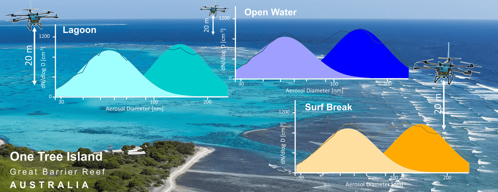

# aerosol-one_tree_island



## Processing mSEMS data sampled with DJI AGRAS T30 near One Tree Island (Great Barrier Reef)


This repository contains R scripts to process, analyse, and visualise aerosol size distribution data collected during drone flights around One Tree Island using a Brechtel Model 9404 Miniaturized Scanning Electrical Mobility Sizer (mSEMS).

https://www.brechtel.com/product/miniaturized-scanning-electrical-mobility-sizer/

The workflow focuses on plotting raw and averaged particle size distributions by location type (Lagoon, Surf Break, Open Water). The raw data was inverted with IGOR using a script provided by Brechtel.

Refer to product manual: 

https://www.brechtel.com/wp-content/uploads/2023/08/bmi_model_9404_mSEMS_manual_v1_3.pdf

---

## Overview

This project demonstrates:

- **Data ingestion:** Loading processed and corrected aerosol size distribution CSV files.
- **Data filtering and summarising:** Grouping data by particle size bins and location, calculating averages and standard deviations.
- **Plotting:** Visualising raw scans and averaged data with error bars, using log-scaled x-axes and consistent y-axis limits.

---

## Script

### `01_clean_msems.R`

- Reads inverted mSEMS data and cleans the .csv file.

### `02_calculate_log_msems.R`

- Calculates dNdlogDp and total concentration out of the cleaned aerosol size distribution data.

### `03_plot_size_distributions.R`

- Generates combined plots with raw scans and mean size distributions plus error bars.

---

## Data

The repository includes:

- Example processed aerosol size distribution CSV files, corrected for measurement biases.
- The transportloss.csv was calculated for the measurement setup with the Particle Loss Calculator (PLC).

https://www.mpic.de/4230607/particle-loss-calculator-plc


> Note: Example data files are subsampled for demonstration.

---

## Output

Generated output includes:

- Aerosol size distribution plots for each flight event by location.
- Plots show raw particle concentration scans and averaged distributions with standard deviation shading.
- Files saved in SVG format for better version control.


## Dependencies

### 📦 Required R Packages

```r
install.packages(c(
  "tidyverse",
  "lubridate",
  "stringr",
  "gridExtra",
  "here"
))
```
---

## Further reading: 
https://www.mdpi.com/2504-446X/8/7/292#

---
